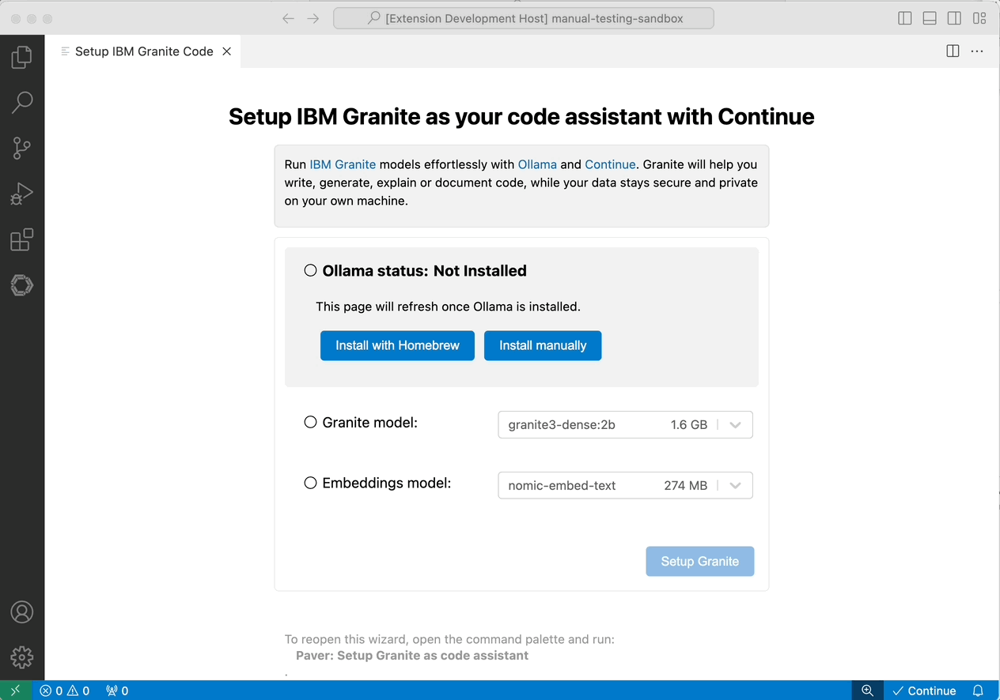
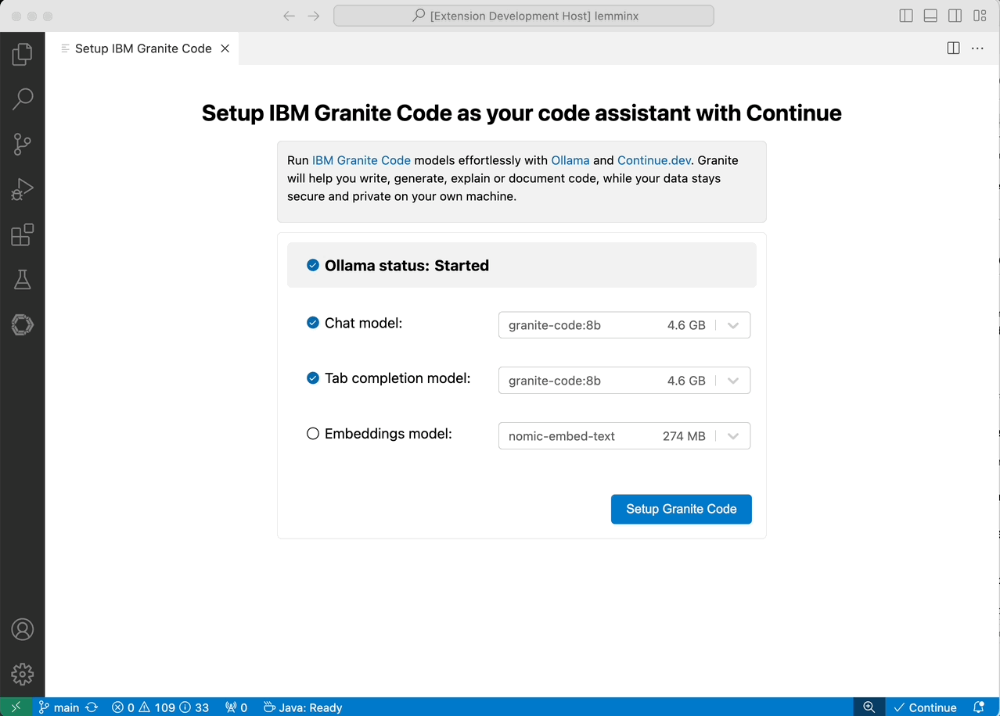

# Paver

`Paver` simplifies the setup of the
[Continue extension](https://marketplace.visualstudio.com/items?itemName=Continue.continue)
to integrate [IBM](https://www.ibm.com/)'s
[Granite code models](https://github.com/ibm-granite/granite-code-models), as
your code assistant in Visual Studio Code, using [Ollama](https://ollama.com/)
as the runtime environment.

By leveraging Granite code models and open-source components such as Ollama and
Continue, you can write, generate, explain, or document code with full control
over your data, ensuring it stays private and secure on your machine.

## Getting Started

This project features an intuitive UI, designed to simplify the installation and
management of Ollama and Granite Code models. The first time the extension
starts, a setup wizard is automatically launched to guide you through the
installation process.

You can later open the setup wizard anytime from the command palette by
executing the _"Paver: Setup Granite Code as code assistant"_ command.

### Installation Prerequisites

- **OS:** MacOS, Linux or Windows
- **Disk Space:** Minimum 30 GB
- **Latest Version of [Visual Studio Code](https://code.visualstudio.com/)**

### Step 1: Install the Extension

Open Visual Studio Code, navigate to the Extensions tab on the left sidebar,
select "Paver," and click "install."

The [Continue.dev](https://continue.dev/) extension will be automatically added
as a dependency, if not already installed. If you installed `Paver` manually,
you may need to also install the Continue extension separately.

### Step 2: Install Ollama

Once the extension is running, the setup wizard will prompt you to install
Ollama.

The following Ollama installation options are available :

1. **Install with Homebrew:** If Homebrew is detected on your machine
   (Mac/Linux).
2. **Install with Script:** Available on Linux.
3. **Install automatically:** Available on Windows, will perform a silent
   installation using sensible defaults.
4. **Install Manually:** Supported on all platforms. If you choose this option,
   you will be redirected to the official
   [Ollama download page](https://ollama.com/download) to complete the
   installation.

Once Ollama is installed, the page will refresh automatically. Depending on the
security settings of your plateform, you may need to start Ollama manually the
first time.

### Step 3: Install Granite Models

Select the Granite model(s) you wish to install and follow the on-screen
instructions to complete the setup.

After the models are pulled into Ollama, Continue will be configured
automatically to use them, and the Continue chat view will open, allowing you to
interact with the models via the UI or tab completion.

## About the Stack

### IBM Granite Code Models

The Granite Code models are optimized for enterprise software development
workflows, performing well across various coding tasks (e.g., code generation,
fixing, and explanation). They are versatile "all-around" code models.

Granite Code comes in various sizes to fit your workstation's resources.
Generally, larger models yield better results but require more disk space,
memory, and processing power.

**Recommendation:** Use Model Size 8B for chat and 8B for tab code completion.

For more details, refer to
[Granite Code Models](https://github.com/ibm-granite/granite-code-models).

### Ollama

Many corporations have privacy regulations that prohibit sending internal code
or data to third-party services. Running LLMs locally allows you to sidestep
these restrictions and ensures no sensitive information is sent to a remote
service. Ollama is one of the simplest and most popular open-source solutions
for running LLMs locally.

### Continue.dev

[Continue](https://docs.continue.dev) is the leading open-source AI code
assistant. You can connect any models and contexts to build custom autocomplete
and chat experiences inside
[VS Code](https://marketplace.visualstudio.com/items?itemName=Continue.continue)
and [JetBrains](https://plugins.jetbrains.com/plugin/22707-continue-extension).

- Easily understand code sections
- Tab to autocomplete code suggestions
- Refactor functions while coding
- Ask questions about your codebase
- Quickly use documentation as context

For more details, refer to
[continue.dev](https://github.com/continuedev/continue).

### How to Contribute to this Project?

Please check our
[Guidelines](https://github.com/redhat-developer/vscode-paver/blob/main/CONTRIBUTING.md)
to contribute to our project.

### License

This project is licensed under Apache 2.0. See [LICENSE](LICENSE) for more
information.

### Telemetry

With your approval, the Paver extension collects anonymous
[usage data](USAGE_DATA.md) and sends it to Red Hat servers to help improve our
products and services. Read our
[privacy statement](https://developers.redhat.com/article/tool-data-collection)
to learn more. This extension respects the `redhat.telemetry.enabled` setting,
which you can learn more about at
[Red Hat Telemetry](https://github.com/redhat-developer/vscode-redhat-telemetry#how-to-disable-telemetry-reporting).
